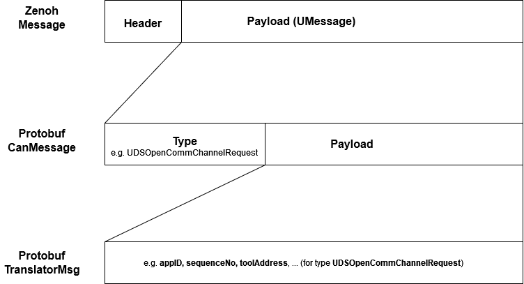

== Overview RPC Client/Server example

This is an example implementation for the use of ZenohUTransport for uProtocol client/server communication with following details:

* Currently simplified approach by using only one single RpcClient/RpcServer instance on each side and thus synchronous processing of communication.

* Server uEntity uses up://test_rpc_server.app/10001/1/C
+
[cols="1,1"]
[width="50%"]
|===
| authority | test_rpc_server
| entity | 0x10001 (65537)
| entity_version_major | 1
| resource_id | 0xC (12)
|===

* Client uEntity uses up://test_rpc_client.app/10001/1/0
+
[cols="1,1"]
[width="50%"]
|===
| authority | test_rpc_client
| entity | 0x10001 (65537)
| entity_version_major | 1
| resource_id | 0
|===

* The resource_id 12 serves as the communication channel of the uEntity via which the communication between client and server takes place. For this purpose, the request/response messages are packaged in a container message “CanMessage” together with the message type.

* Based on the message type, the messages can be assigned to the appropriate method in the client/server.

== CanMessage

== RPC usage with ZenohUTransport

